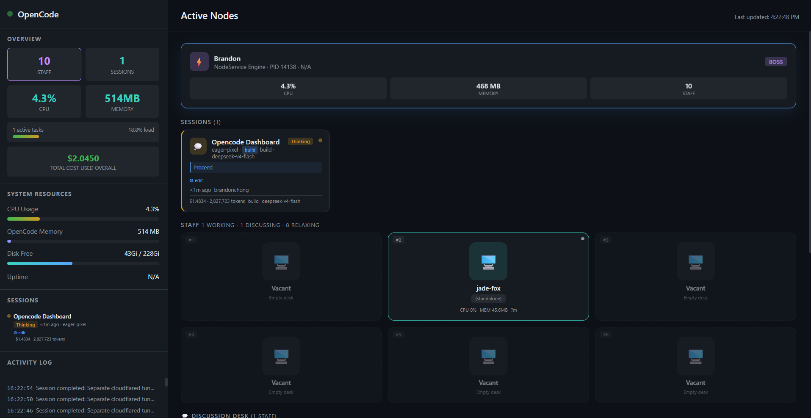

# MyDora Dashboard

Real-time activity dashboard for MyDora agents, sessions, and system resources with a staff office metaphor.



## Features

### Active Nodes (Main View)
- **Content Tabs** — switch between Sessions, Virtual Office, and Others
- **Brandon Card** — always visible boss status card with CPU, memory, staff count, and **Manage** button
- **Sessions Panel** — real-time task cards with state (thinking/running-tools/complete/error), cost, tokens, and agent details
- **Virtual Office Panel** — Office Floor (6 numbered desks), Discussion Desk (virtual staff thinking/running-tools), Rest Room (12 activity spots with dynamic state cycling)
- **Others Panel** — standalone processes not matched to any session

### Sidebar
- **Overview** — staff count, session count, CPU, memory, active tasks, load bar, total cost
- **System Resources** — CPU usage, memory, disk free, uptime
- **Session List** — active sessions with quick preview
- **Activity Log** — transient commands, session cleanup, worker lifecycle
- **Admin Panel** — login button

### Admin Panel
Click the **Admin Panel** button in the sidebar or **Manage** on the Brandon card. Full-screen modal with 6 tabs:

| Tab | Contents |
|---|---|
| **Sessions** | Sessions grouped by workspace, search/filter, View (metadata), Continue (last prompt + response + new instruction with model & mode dropdown), **+ New Case** button (start a new session with title, instructions, mode, model, workspace) |
| **System** | Daemon status, restart/kill controls |
| **Users** | Manage dashboard users (admin role only) |
| **Settings** | Poll interval, session retention, max log entries |
| **Security** | Change password |
| **Logs** | Full activity log viewer with search |

## Usage

```bash
bash start.sh
# Opens http://localhost:5500
```

### Default Credentials

- **Email:** `brandon@kkbuddy.com`
- **Password:** `#Quidents64#`

## How It Works

- **Poller** (`poller.py`) collects `ps aux` data, queries `opencode session list --format json`, enriches sessions via `opencode export`, and gathers available models (opencode + Ollama) every 2 seconds
- **Unified Server** (`server.py`) serves static files and a JSON admin API (start/stop/continue session, restart/kill daemon, ping) on a single port — no cross-origin issues
- **Daemon** (`daemon.sh`) loops the poller indefinitely
- **Frontend** reads `data/status.json` and renders the dashboard with 2-second auto-refresh
- **Auth** uses SHA-256 hashed passwords in localStorage; login state persists in sessionStorage

## Architecture

```
daemon.sh ──→ poller.py ──→ data/status.json ──→ index.html (public)
                                                    ↑
server.py (port 5500) ── serves static files ───────┘
                    ── /api/* endpoints ──→ admin panel actions
```

## Data

The dashboard auto-refreshes every 2 seconds. No database required. All state is kept in `~/.opencode-dashboard/data/`.

## License

MIT
